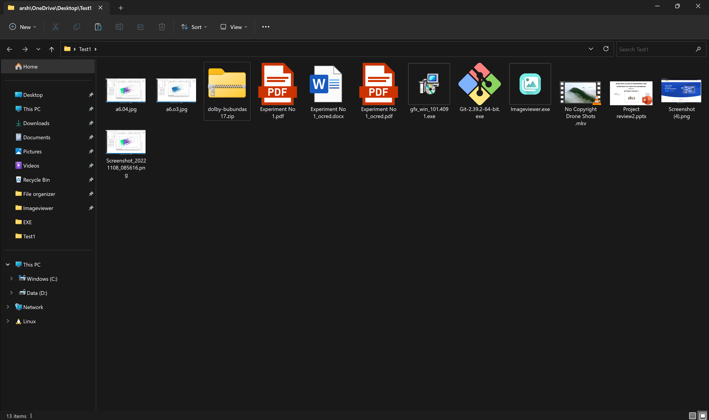
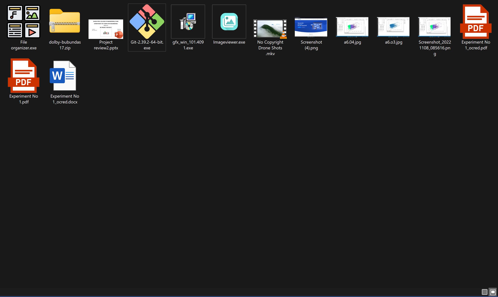
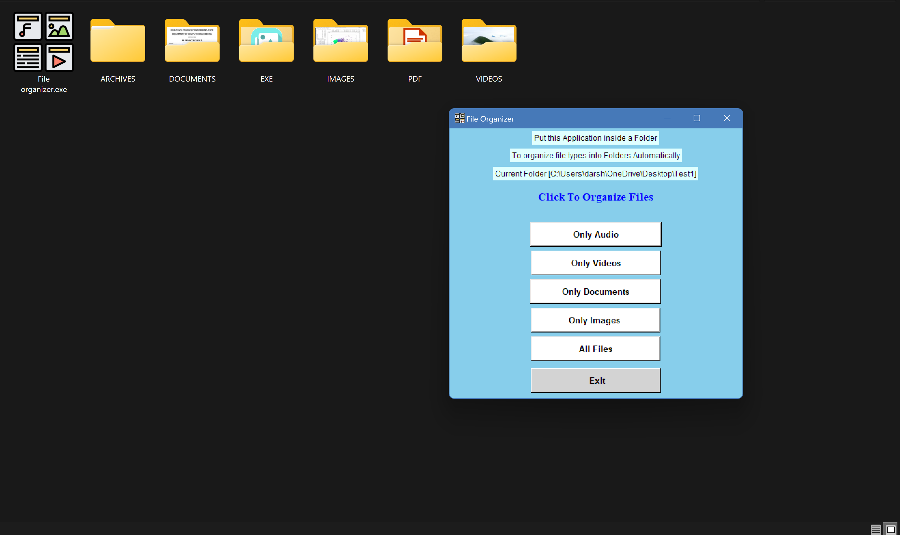

# File-Organizer
Organize All types of File Formats by their Folders Using this Application

# How To Use
Place this Application Inside a Folder/Desktop Where You Need To organize all your different file types like audios , videos into a Folder according to their type.

Then Arrange all your Files Accordingly (This needs to be done Just once and Cannot be reverted)

To Arrange Other folder Just Cut the Exe from that Folder and Place Inside a Folder You Need to Organize.

# Screenshots

This Is your Cluttered Folder Containing All Files Unorganized.

Download The Application And Place The App Inside This Unorganized Folder. 

Open The App and Choose How you Want to organize Your Files, Eg Clicking on All Files Will Be Executed as Below

# Download File: 
Go to dist folder then download "file Organizer.exe" file